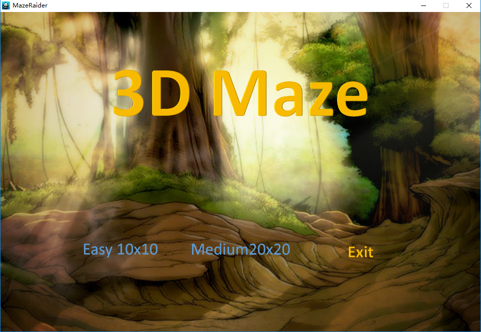
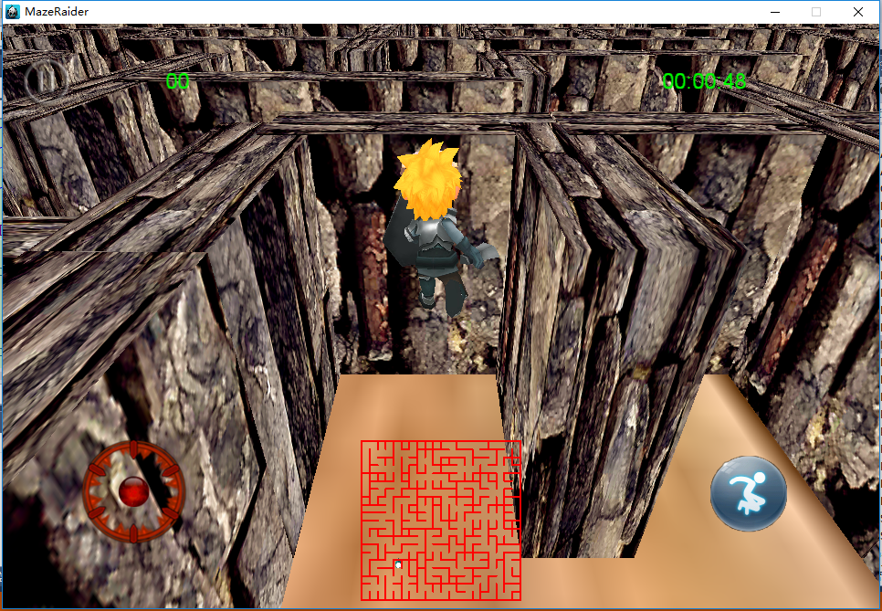

# 基于cocos2d-x的3D迷宫demo
在cocos2d-x实现3D迷宫随机生成。

## 迷宫生成算法
迷宫生成算法是从[chenyukang/Maze](https://github.com/chenyukang/Maze)改造而来，路径生成使用并查集。
## 摄像头跟随
本来打算使用第三人称3D摄像头跟随人物移动，但是发现有一些bug，并不能正常使用，目前摄像头是2.5D的，也就是人物转向时摄像头不能跟着移动。